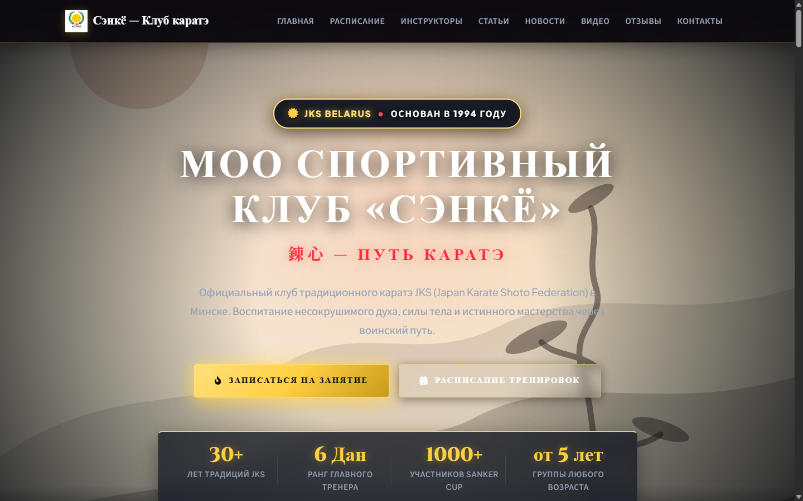
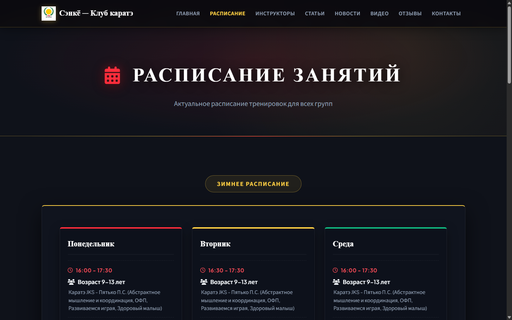
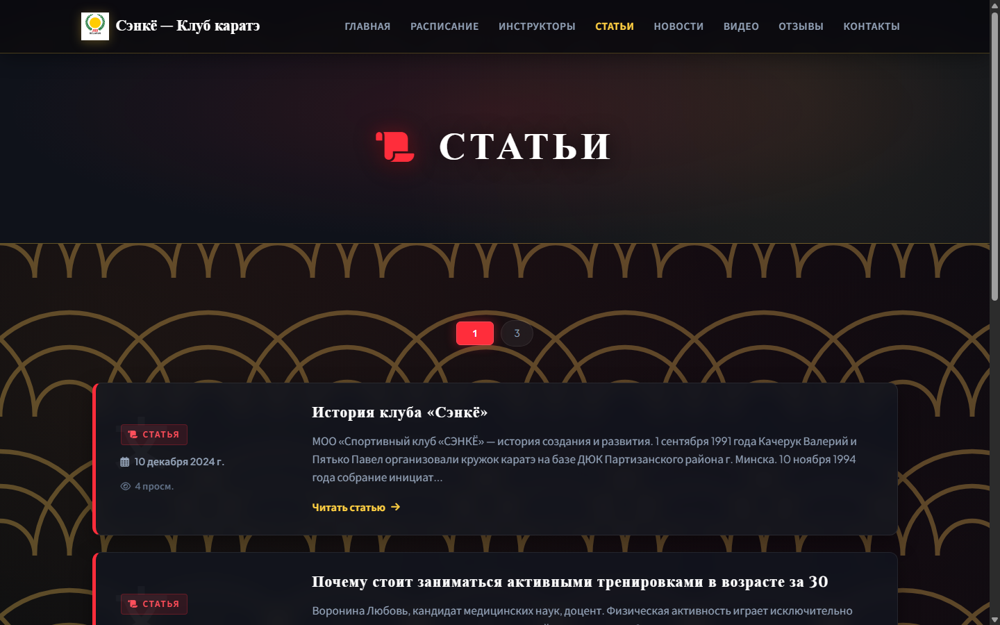
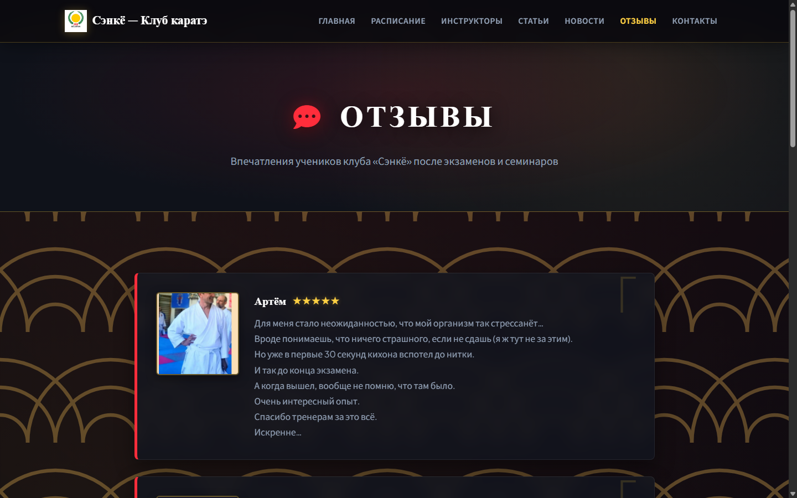

# Сайт спортивного клуба каратэ «Сэнкё»

Официальный веб-сайт МОО «Спортивный клуб «СЭНКЁ» (JKS Belarus, Минск). 

Веб-сервис с адаптивным пользовательским интерфейсом в стилистике традиционных японских мотивов и закрытой панелью управления контентом.

---

## Демонстрация интерфейса

### Главная страница


### Расписание тренировок


### Статьи и публикации


### Отзывы воспитанников и родителей


---

## Стек технологий

- **Backend:** Node.js, Express.js
- **База данных:** MySQL (`mysql2/promise`)
- **Загрузка и хранение медиа:** Multer
- **Frontend:** Vanilla JavaScript (ES6+), HTML5, семантический модульный CSS3
- **Контентный редактор:** Quill.js (WYSIWYG)
- **Интеграции:** YouTube Data API v3

---

## Структура репозитория

```text
Site_For_Club/
├── docs/                     # Документация и скриншоты проекта
│   └── screenshots/          # Скриншоты страниц сайта
│
├── Project-MySQL/            # Основная версия проекта (Express + MySQL)
│   ├── backend/              # Серверная часть
│   │   ├── routes/           # API-роуты (админка, статьи, новости, тренеры, расписание, отзывы)
│   │   ├── mysql-adapter.js  # Подключение к MySQL и выполнение запросов
│   │   └── server.js         # Запуск Express-сервера
│   ├── database/             # Скрипты структуры базы данных
│   │   ├── mysql_init.sql    # Инициализация таблиц и стартовые данные
│   │   └── mysql_stored_procedures.sql
│   └── frontend/             # Клиентская часть сайта
│       ├── css/              # Модульная таблица стилей
│       ├── js/               # Клиентские скрипты страниц
│       ├── img/              # Графика и элементы оформления
│       ├── uploads/          # Загруженные файлы и изображения
│       ├── index.html        # Главная страница
│       ├── schedule.html     # Расписание
│       ├── articles.html     # Статьи и методические материалы
│       ├── news.html         # Новости
│       ├── reviews.html      # Отзывы
│       └── admin.html        # Панель управления
│
├── Project/                  # Предыдущая версия на SQLite (архив)
├── .gitignore
└── README.md
```

---

## Основной функционал

### Публичная часть
- **Интерактивное расписание:** просмотр графика тренировок с разделением на сезоны (зима / лето), по дням недели и возрастным группам.
- **Материалы и статьи:** база методических статей с возможностью прикрепления файлов для скачивания и древовидной системой комментариев.
- **Лента новостей:** клубные анонсы, отчёты о поездках и турнирах.
- **Тренерский состав:** профили инструкторов с указанием спортивных разрядов, судейских категорий и данов JKS.
- **Отзывы:** впечатления родителей и спортсменов о тренировочном процессе и экзаменах.
- **Медиагалерея:** интеграция с клубным каналом YouTube.

### Панель управления (`/admin.html`)
- Вход в панель управления через защищённую форму авторизации.
- Разделение прав доступа: администратор и супер-администратор (управление учётными записями).
- Полное управление контентом (создание, редактирование, удаление):
  - Публикации и новостные посты
  - Загрузка вложений и скачиваемых файлов
  - Расписание занятий по залам и дням недели
  - Список тренеров с загрузкой фотографий
  - Модерация отзывов
- Встроенный визуальный редактор текста Quill для оформления статей.

---

## Быстрый запуск

### 1. Подготовка базы данных
Импортируйте начальную схему в MySQL:
```bash
mysql -u root -p < Project-MySQL/database/mysql_init.sql
```

### 2. Запуск приложения
Перейдите в папку бэкенда, установите зависимости и запустите сервер:
```bash
cd Project-MySQL/backend
npm install
npm start
```

Сайт будет доступен в браузере по адресу:  
`http://localhost:3000`
